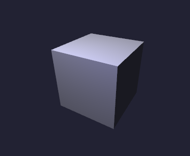
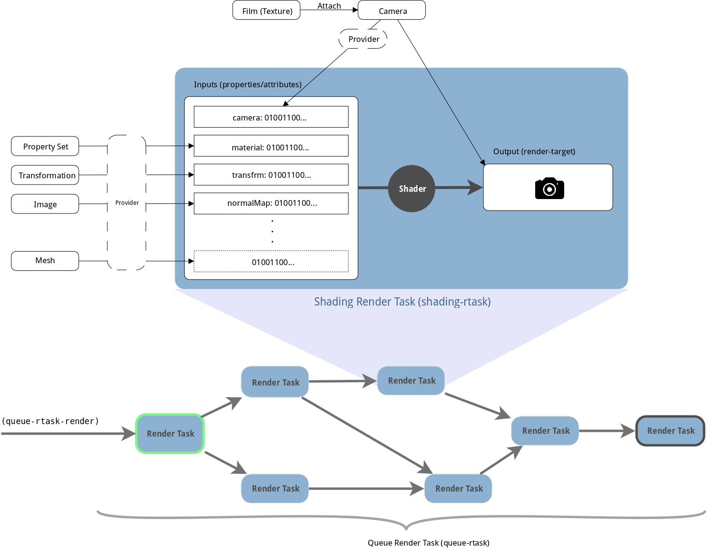

# 概况

Shader Tool以GUILE Scheme作为脚本后端，C++编写渲染器后端，可以非常方便地组合复杂的着色器程序。它提供了一个完备的、带有GNU Readline的REPL，方便用户在运行时观察和调整各种参数。

## 总目录

1. [概况](README.md)
2. [脚本编写](scripting.md)
3. [反射框架](reflection.md)
4. [单元测试框架](unit-test.md)
5. [杂项/截屏](misc.md)

## 编译/安装

请保证CMake已安装好。CMake在生成Makefile之前将会检查系统中是否已有这些软件。

- GUILE Scheme
- OpenGL (3.3)
- GLEW
- GLFW

```
$ mkdir build
$ cd build
$ cmake .. && make
$ . set_env.sh
$ shrtool/shrtool_repl
```
`set_env.sh`中设置了一些必要的环境变量，以保证程序能正常寻找到所需的文件。若你将assets文件夹移往别处，请务必将环境变量设置为正确的值。

## 入门

`assets/examples`中已经准备好几个展示用例，可以直接加载其中的`scene.scm`（假设用户当前目录在build下）。

```
> load "../assets/examples/blinn-phong-box/scene.scm"
```

等价地，你可以在Shell中直接带参数运行`shrtool_repl`

```
$ shrtool/shrtool_repl -c 'load "../assets/examples/blinn-phong-box/scene.scm"'
```

你可以见到窗口弹出，并显示一个方盒（还有更多的示例，你可以参考[杂项/截屏](misc.md)中的截图）。



想要恢复初始状态，你可以执行：

```
> set! main-rtask #nil
```

当然你还可以在其中进行任何的求值和调用GUILE提供的函数。记得遵循Scheme Lisp的语法。至于Lisp中烦人的括号，shrtool将会帮你自动补全，这使得控制台中输入语句与大家习惯的shell命令非常相像。有没有觉得很爽 ;-)

```
> cos (* pi 2)
$1 = 1.0
> display "hello world\n"
hello world
```

## 环境变量

- `SHRTOOL_ASSETS_DIR`：shrtool将从这里寻找非C++的代码的资源文件。
- `SHRTOOL_LOG_LEVEL`：日志等级。一般设置为20000（INFO级别）。0为VERBOSE，`$((0x7fffffff))`大概就可以静音了吧（笑）
- `GUILE_LOAD_PATH`：严格来说并不是shrtool的环境变量，GUILE根据它寻找模块。对于shrtool而言，一般设置为`$SHRTOOL_ASSETS_DIR/modules`

## 项目概览



shrtool提供了一些基础环境，方便用户去“组装”自己的渲染流程。渲染流程如图所示。下面分别介绍各个组成部分和术语的解释。

### Render Task

渲染流程以Render Task（下文称rtask）为中心。每一个rtask有0个或多个依赖，也就是在执行该rtask之前必须保证它的依赖也已执行。每一个rtask有一个`render`方法，每一帧shrtool主循环会执行`main-rtask`的render方法，也即`main-rtask`是整个渲染流程的入口。

有四种Render Task可供用户使用。

- Shading Render Task：它的`render`代表了一个着色器的单次执行。想要它正常运作，必须给它提供满足着色其所需的所有信息：网格信息、纹理信息、材质参数……
- Queue Render Task：它的`render`代表了在其中排队的rtask的、满足依赖顺序的一系列执行。它接收任意类型的rtask在其中的排队，并且解析依赖并构造一个满足依赖的执行顺序。
- Void Render Task：它不做任何事情，一般用作其前驱rtask的汇聚点，方便解耦。
- Procedure Render Task：它在宿主机执行的不带参数的过程（形如`void f(){ ... }`或`(lambda () ...)`的函数）

### Resource & Providers

Resource的可以是**任意东西**：广义的渲染参数（Property Set）、网格数据（Mesh）、带格式的图像（Image）、广义的纹理（Texture/Texture 2D/Texture Cubemap）、几何变换（Transformation）、相机（Camera），**只要他们定义了相应的提供器（Provider）**。

提供器是方便人类理解的数据结构和方便显卡理解的序列化数据之间的桥梁，与大多数框架/引擎/语言中的`Serializer`有相似的概念。Provider中特有的功能是，它作为桥梁，两端（即带结构的数据，和扁平化、序列化的数据两端）是紧密连接的，**数据结构中的数据发生变化，会自动通知到序列化数据相应地发生变化**。为了不使这些更新太过于影响性能，这些更新是懒惰的（不使用则不更新）并且（尽可能）部分更新。

### Render Target

Render Target狭义下就是指Camera。Camera可以是本身就是屏幕，也可以是一部真正的“相机”。你可以往里面塞一张菲林（文艺用语，事实上就是指纹理），使之成为真正可用的相机。

之所以说Camera是狭义的Render Target，是因为Render Target本不应该带有几何变换信息（位置、朝向等），但是Camera是带有的。它提供的视矩阵和投影矩阵，对于一次渲染来说是不可或缺的参数，它的Provider也已经定义好。所以它也是Resource的一种。

### Shader

着色器由数个子着色器（Sub-shader）和数个渲染信息定义组成。子着色器中可以是Vertex Shader, Geomerty Shader, Fragment Shader (TODO: Compute Shader)中的一个，由GLSL写成。渲染信息的定义可以是渲染参数组（Property Group），网格属性（Attributes）中的一个，主要是要定义他们的Layout，这与未来提供的序列化数据的格式息息相关。

要了解Shader的编写方法，请参考`assets/shaders/*`。

### etc.

对于本项目来说非常重要的反射框架、单元测试框架和日志框架，将在其它文档当中介绍。

## 后记

从本项目开启以来还不足半年（03/03/2017），必然还有许许多多的Bug等着我去修。若你遇到了无法编译、出现了预期以外的运行结果，请不要迟疑来联系我或者file issues。

API文档还在完善当中，恕我不能立刻提供。

