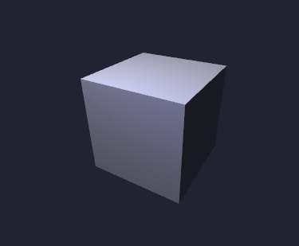

# 杂项

不适合长篇大论的杂项信息。

## 示例

### Blinn Phong 方盒

### 带PCF的阴影贴图

左下角显示了当前的阴影贴图。提供了一个`rotate-light`函数来移动灯光。

### 综合水池模拟

提供了`drop`函数来对水面进行扰动，以及`reset-water`来恢复原状。

### 二维柏林噪音产生的体积云

提供了`cloud-travel`来在云朵之中穿行，真是如此梦幻而浪漫。

## 日志

日志提供了5个级别：

- DEBUG = 10000：最吵的级别。除非Debug，否则开启了它无法做任何事情。
- INFO = 20000：让用户对当前情况的理解有帮助的信息。
- WARNING = 30000：一些不致命错误的警告。
- ERROR = 40000：发生了相当的错误。
- FATAL = 50000：足以让程序崩溃的错误。

用户可以在两个级别之间插入自己的日志流，这也是两个级别之间间隔如此之宽的原因。Log Manager有一个Log Level，如果当前级别比要记录的级别高，则会丢弃这部分日志。所以设置为0可以开启所有的日志，设置为`0x7fffffff`可以完全静音。只是一般来说，50001已经足够静音的了。

